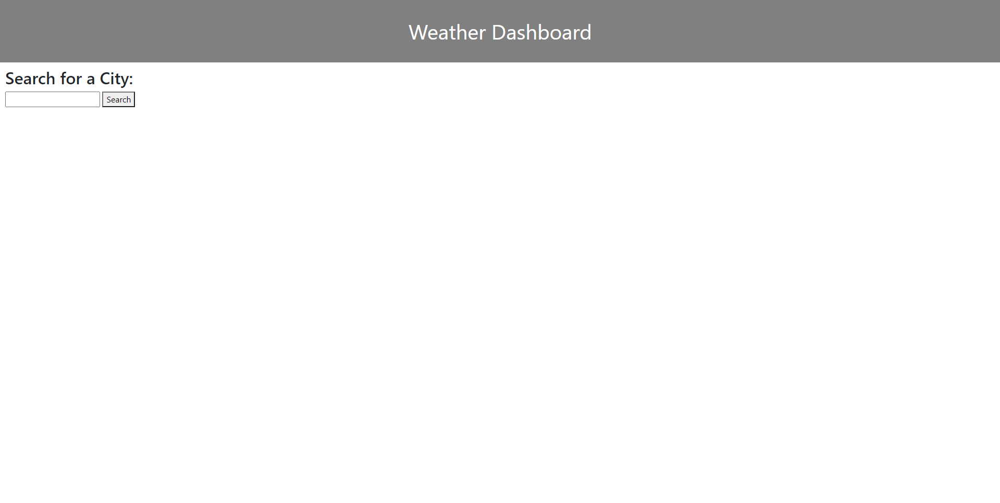
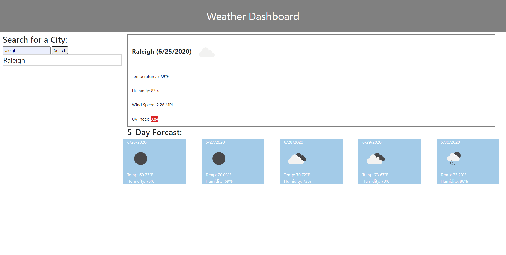
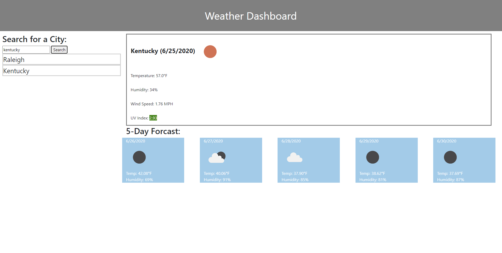
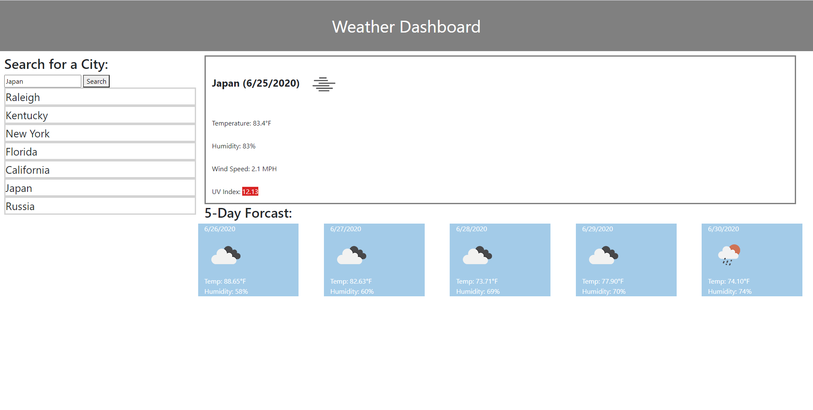

# 06 Server-Side APIs: Weather Dashboard

A weather application is developed to retreive weather data for cities for the current day and a 5 day forcast.

Here is the link to the URL of the application. https://phakpa.github.io/weatherDashboard/

Here is the link to the Github repository. https://github.com/phakpa/weatherDashboard

images below ------------------------------------------------------------------------------

